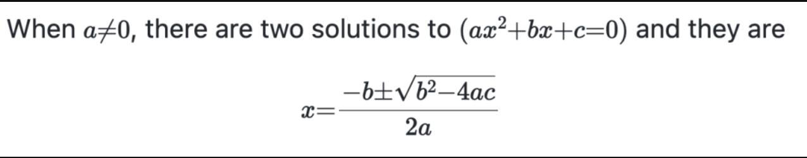

# Markdown Guide

This includes the syntax for markdown.

## Headers
```
# Header1
## Header2
### Header3
#### Header4
###### Header5
```
## Italics
``` _Italics_ ```

## Strong/Bold

``` **I am bold** ```

## Bold and Italics
``` ***900*** ```

## Links 
``` [Visit](https://github.com/VinayMayavanshi13/Markdown-Guide)  ```

## Strikethrough
``` ~~1000~~ ```

## Images
```  ```
E.g 
```  ```

## To include code
Use Backticks
- E.g
```
    ``` javascript
            var name = "Porus"
       
    ```
```

## Tables 
```
|Sr. No  |Items  |Quantity|
|--- |--- |--- |
|1. |Chairs |8
|2. |Tables |2
```
## Blockquote
``` 
> Hello there,this is the effect you get.
```
## Horizontal line
``` --- ```

## List 
``` 
1. One
2. Two
3. Three
    1. Four
    2. Five

- List 2
``` 
## Math in Markdown

Mathematical expressions are key to information sharing amongst engineers, scientists, data scientists and mathematicians. You can use the $ and $$ delimiters natively in Markdown on GitHub to insert math expressions in TeX and LaTeX style syntax. This content is then rendered using the highly popular MathJax library.

For example, the following Markdown,

```
When $a \ne 0$, there are two solutions to $(ax^2 + bx + c = 0)$ and they are 
$$ x = {-b \pm \sqrt{b^2-4ac} \over 2a} $$
```

will render as:


---